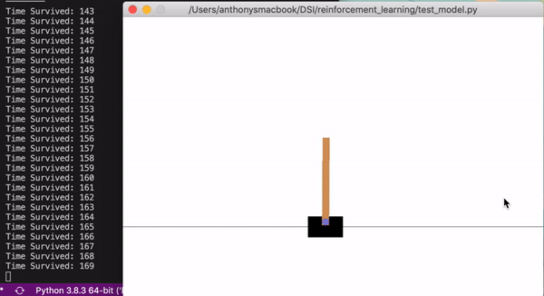

# Reinforcement Learning

by Anthony Clemens

### Abstract
I am using openAI `gym` to train reinforcement learning models to solve the cartpole control problem. I have implemented two solutions to the problem, a Deep Q-Network (DQN) algorithm using `keras`, and a neuroevolution of augmenting topologies (NEAT) genetic algorithm using `neat-python`.

### Problem Statement
The purpose of this project is an evaluation of the state of modern reinforcement learning algorithms and their applications. Deep learning advancements in reinforcement learning have not only improved the capabilities of artifical intelligence (AI) but also made AI more accessible. I personally wanted to explore the capabilities of modern reinforcement learning algorithms and what kind of problems they can solve.

> It is shown that modern reinforcement learning algorithms such as DQN and NEAT are capable of solving problems in simulation without being explicitly told how to behave. 

## Theory
### Part 1: Deep Q-Network

**Figure 1:** Results for DQN agent after training on 2000 episodes. 

When I say agent I am describing the AI that interacts with the simulated environment. The resulting agent has effectively solved the problem at hand (it is able to balance the pole forever) without being explicitly told how to behave. Instead, simply observing the rewards of random actions was enough for the algorithm to construct a successful policy (strategy) to the problem at hand. Due to the fact the policy was not explicitly specified and obtained via random exploration this is denoted off-policy learning.

An essential concept to reinforcement learning is Q-learning, which is based upon the idea of a Q-function: 

> *The Q-function quantifies the reward an agent may recieve given it's current state and next action*. 

 Depending upon the complexity of the problem, it may be too difficult to write the explicit mathematical formula for the Q-function by hand. The Deep Q-Network algorithm solves this problem as a neural network is used to approximate the Q-function. In effect, the explicit mathematical formula for the Q-function is not needed.

 In simplest terms, the neural network maps the current state the agent is in to the next action with greatest reward. For the cartpole problem the state includes 4 variables, the cart position, cart velocity, pole angle, and pole angular velocity. Additionally, the two actions that can be taken are either move the cart left or right.

When the neural network is first initialized, it does not yet have any understanding of the environment it will be working in. That is why we first train it using random actions. However, once the model has been trained a bit and has obtained a sense of the environment, we want to start trusting the model's policy. The exploration rate is the parameter that quantifies whether we choose a random action, or the model's action. The exploration rate is initialized at 1 (pure random actions) and decays (uses the model more) as training proceeds. The exploration/exploitation trade off is the dilemma of trusting our model (exploitation) and getting an expected result or choosing a random action (exploration) and possibly learning something knew.

### Part 2: Neuroevolution of Augmenting Topologies (NEAT)

Developed by Ken Stanley in 2002, the NEAT genetic algorithm is a novel algorithm, which not only alters the weighting parameters of the neural network, but also the architecture of the neural network itself. The beauty of the NEAT algorithm is you don't need to know the best neural network architecture for the problem at hand, since the architecture of the neural network complexifies through the algorithm. Essentially, the best neural network architecture will be produced from the algorithm. 

In the implementation of `neat-python` I am using, the algorithm starts out with a population of individual `genomes`. Each `genome` contains two sets of `genes` that describe how to construct a neural network.

1. Neuron genes, specifices a single neuron.
2. Synapse genes, specifices the connection between two neurons.

A fitness function quantifies the quality of an individual genome. The better the ability to solve the problem at hand the higher the fitness functions score. After the population of `genomes` are evaluated the next generation is produced through either sexual or asexual reproduction, and mutation of the fittest individuals from the previous generation. 

This process repeats for the number of generations you have set or until a fitness threshold is reached. The reproduction and mutation operations in the algorithm may add neurons and/or synapses to `genomes`, so as the algorithm proceeds `genomes` will increase in complexity.

## Results

## Conclusion
